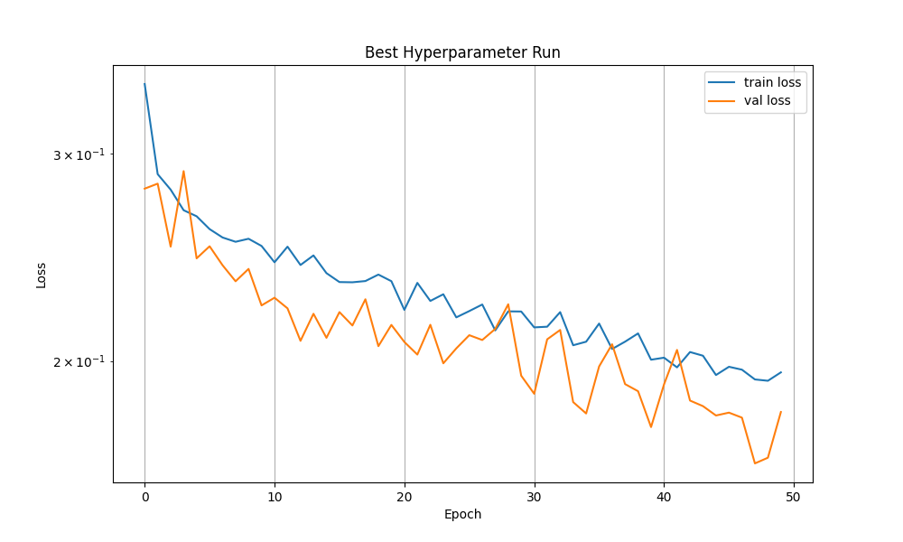

# ☀️Solar Cell Defect Classification

Binary classification system for detecting defects in solar cell images using a custom ResNet architecture. Achieves 83% F1-score on the validation set.

## Problem Description

The task involves classifying solar cell images into two defect categories:
- **Crack**: Physical cracks in the solar cell
- **Inactive**: Regions with no power generation

Images are 300x300 pixels in RGB format. The model outputs a 2-dimensional probability vector for multi-label classification.

## Architecture

The model is based on a custom ResNet implementation with residual blocks and skip connections:

```
Input (3x300x300)
    |
    v
[Conv2d 7x7, stride=2, 64 filters]
    |
    v
[BatchNorm2d + ReLU]
    |
    v
[MaxPool2d 3x3, stride=2]
    |
    v
[ResBlock: 64 -> 64, stride=1]
    |
    v
[ResBlock: 64 -> 128, stride=2]
    |
    v
[ResBlock: 128 -> 256, stride=2]
    |
    v
[ResBlock: 256 -> 512, stride=2]
    |
    v
[Global Average Pooling]
    |
    v
[Flatten]
    |
    v
[Fully Connected: 512 -> 2]
    |
    v
[Sigmoid]
    |
    v
Output (2 classes: crack, inactive)
```

### Residual Block Structure

Each ResBlock follows this pattern:
```
        input
          |
    +-----+-----+
    |           |
    v           |
Conv 3x3        |
    |           |
    v           |
BatchNorm       |
    |           |
    v           |
  ReLU          |
    |           |
    v           |
Conv 3x3        |
    |           |
    v           |
BatchNorm       |
    |           |
    v           |
   (+) <--------+ (skip connection)
    |
    v
  ReLU
    |
    v
  output
```

When stride ≠ 1 or dimensions change, a 1x1 convolution is applied to the skip connection to match dimensions.

## Training Strategy

The training follows a two-phase approach:

### Phase 1: Hyperparameter Tuning
Grid search over:
- Learning rates: `[1e-4, 3e-4, 1e-3]`
- Batch sizes: `[16, 32]`
- Optimizers: `[Adam, SGD]`

Run with:
```bash
python train.py
```

Results are saved to `hparam_results.csv`.

### Phase 2: Refinement
Continued training on the best model with:
- Lower learning rate: `3e-5`
- Stronger weight decay: `5e-4`
- Early stopping patience: 8 epochs
- Batch size: 32

Run with:
```bash
python train.py refine_best
```

This refinement phase prevents overfitting and achieves the final F1-score of 83%.

## Project Structure

```
.
├── train.py              # Main training script
├── trainer.py            # Trainer class with early stopping
├── model.py              # ResNet architecture definition
├── data.py               # Dataset and data loading utilities
├── data.csv              # Dataset metadata (image paths and labels)
├── checkpoints/          # Saved model checkpoints
│   ├── model_final.ckp   # PyTorch checkpoint
│   └── model_final.onnx  # ONNX export for deployment
└── README.md
```

## Requirements

- Python 3.9+
- PyTorch 1.13+
- torchvision
- numpy
- pandas
- scikit-learn
- matplotlib
- tqdm

Install dependencies:
```bash
pip install torch torchvision numpy pandas scikit-learn matplotlib tqdm
```

## Usage

### Training from Scratch

1. Prepare your dataset in `data.csv` with columns: `filename`, `crack`, `inactive`
2. Run hyperparameter tuning:
   ```bash
   python train.py
   ```
3. Refine the best model:
   ```bash
   python train.py refine_best
   ```

### Inference

```python
import torch
from model import ResNet

# Load model
model = ResNet()
model.load_state_dict(torch.load('checkpoints/model_final.ckp'))
model.eval()

# Prepare input (3x300x300)
image = torch.randn(1, 3, 300, 300)

# Predict
with torch.no_grad():
    output = model(image)
    crack_prob = output[0, 0].item()
    inactive_prob = output[0, 1].item()
```

### ONNX Export

The trained model is automatically exported to ONNX format for deployment:
```python
import onnxruntime as ort

session = ort.InferenceSession('checkpoints/model_final.onnx')
input_name = session.get_inputs()[0].name
output = session.run(None, {input_name: image_numpy})
```

## Results



| Metric | Value |
|--------|-------|
| F1-Score | 83% |
| Training Strategy | Warm start + refinement |
| Final Learning Rate | 3e-5 |
| Best Validation Loss | ~0.32 |

The model successfully generalizes to the validation set without significant overfitting, as evidenced by the stable validation loss curve during refinement.

## Key Implementation Details

### Data Augmentation
Applied during training (see `data.py`):
- Random horizontal/vertical flips
- Random rotations
- Color jittering
- Normalization to ImageNet statistics

### Regularization
- Weight decay: `5e-4`
- Early stopping with patience: 8
- Batch normalization in residual blocks
- Global average pooling instead of fully connected layers

### Training Tips
- Use warm start from previous checkpoints to continue improving
- Monitor the gap between train and validation loss
- Reduce learning rate if validation loss plateaus
- The model benefits from extended training with careful regularization

